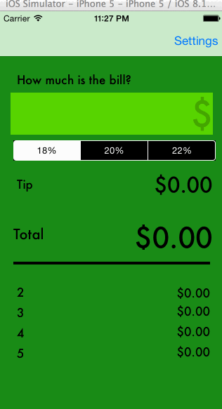

# Tip Calculator

This is a basic iOS tip calculator written in Swift

Time spent: ~3 hours 

Completed user stories:

 * [x] Required: User can enter a bill subtotal and see the tip amount and total
 * [x] Required: User can change tip % (supported 18%, 20%, 22%)
 * [x] Required: User can select a default tip % in the settings view which is
   stored for future use
 * [x] Optional: User can select a preferred color theme (light or green) in
   settings view which is stored for future use
 * [x] Optional: User can see bill total split between multiple users (1-5)
 * [x] Optional: Improved currency formatting by using NSNumberFormatter
 * [x] Optional: Animation when toggle between color themes in settings view

Possible future features:

 * Store user's bill history
 * Allow greater control over tip % by changing from UISegmentedControl to
   Slider
 * Nicer animations and graphics

Walkthrough of all user stories:

 
